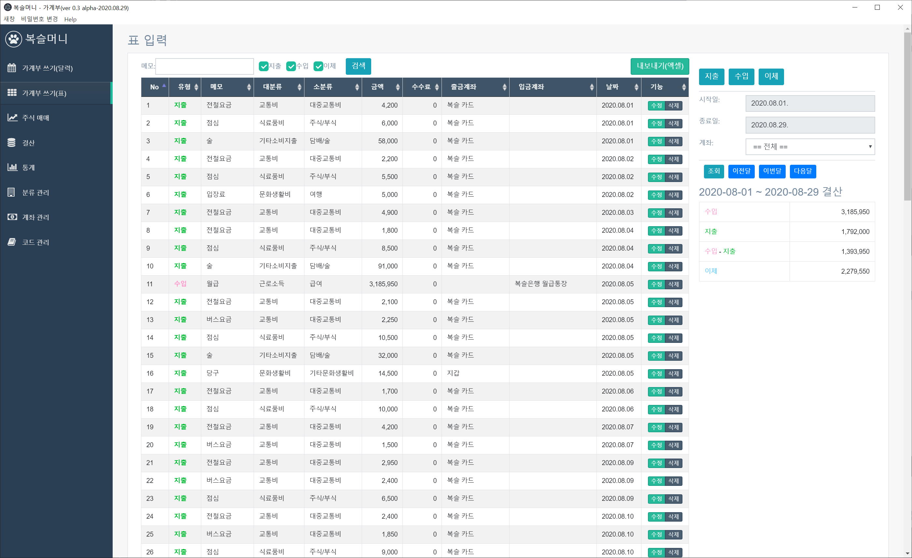
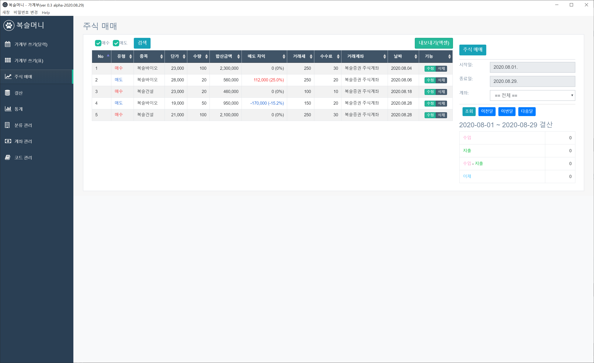
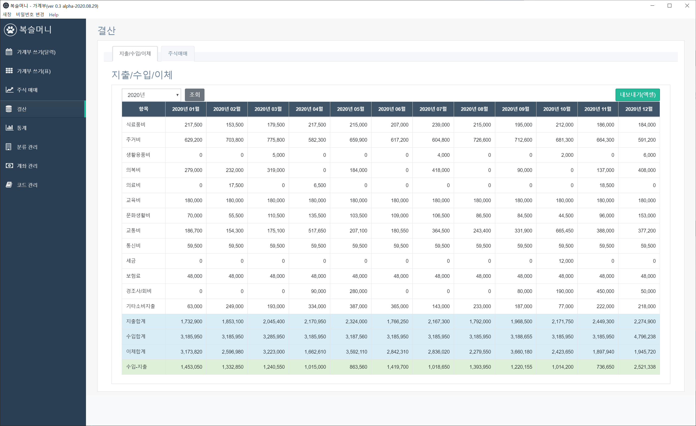
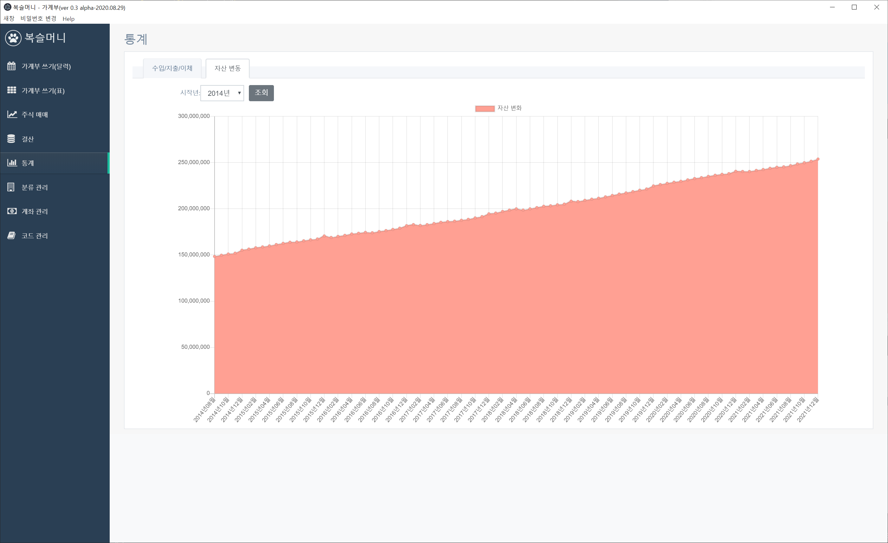

# 복슬머니

가계부 프로그램

## 주요기능
* 계좌(통장, 카드, 주식 등) 등록 및 관리
* 달력 및 목록 방식 조회
* 자주쓰는 거래 내역 등록
* 년단위 기준 월 결산
* 결과 목록 엑셀 내보내기
* 분류 및 각종 코드관리
* 수입/지출/이체 내역 및 자산 변동 통계

### 초기 셋팅

```bash
# 사전 작업
Start-Process powershell -Verb runAs
# powershell 창 열런 상태에서 실행
# 명령어 실행이 오래(10분 이상) 걸릴 수 있다.
npm --add-python-to-path='true' --debug install --global windows-build-tools

# 다시 일반 terminal에서 명렁이 실행
npm run postinstall

# install dependencies
npm install

#./dise/ 폴더에 실행파일 만들어짐.
npm run build
```

### 개발 실행
1. `npm start` 실행
1. 로그인. 기본 비밀번호 `boksl`

### 인스톨 버전 만들기

```bash
#./dise/ 폴더에 실행파일 만들어짐.
npm run build
```

---
## 주요화면
* 달력 보기


* 지출 입력


* 목록 보기


* 결산 내역


* 수입/지출/이체 그래프


* 자산 변환 그래프


* 계좌 목록


---

## 문제 해결에 도움이 된 사이트

### Vscode 관련

1. Prettier 설정(포맷팅 등) [https://ux.stories.pe.kr/150](https://ux.stories.pe.kr/150)
1. ESLient 설정 [https://eslint.org/docs/rules/](https://eslint.org/docs/rules/)
